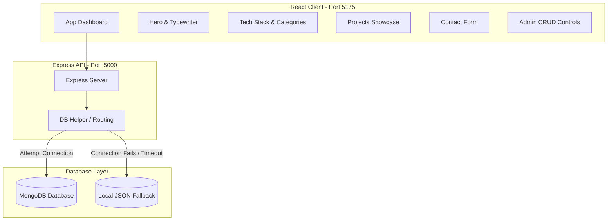

# 🌐 Full-Stack Personal Portfolio Website

A premium, interactive personal portfolio website designed to showcase projects, skills, and academic history. The application is built using a modern full-stack architecture with a React.js client, a Node.js/Express.js REST API, and a MongoDB database.

### 🔗 Live Links
*   **Live Demo Website:** [https://mohankrishna-portfolio.vercel.app](https://mohankrishna-portfolio.vercel.app)
*   **Live API Server:** [https://mohankrishna-portfolio-api.vercel.app/api/status](https://mohankrishna-portfolio-api.vercel.app/api/status)

---

## 🏗️ Architecture Overview



---

## 🚀 Key Features

*   **Cyberpunk Neon Dashboard:** A responsive, glassmorphic UI layout featuring smooth scroll detection, customized scrollbars, and dynamic float animations.
*   **Live API & DB Status Tracker:** An active status light in the navbar indicating real-time server connection health (MongoDB vs. Local JSON Fallback).
*   **Dual Storage Database Failover:** Smart database utility that attempts a Mongoose connection to MongoDB. If the database is offline, it automatically falls back to reading/writing structured JSON files so the app never crashes.
*   **Admin CRUD Panel:** Toggleable Admin Lock/Unlock mode that grants editing permissions directly in the UI to dynamically add, edit, or delete projects and skills.
*   **Real-Time Visitor Inbox:** A validated contact form that POSTs submissions directly to the API, displaying incoming messages live in the Admin inbox.
*   **Animated Typewriter Subtitle:** A typing visual loop summarizing professional specializations.

---

## 🛠️ Technology Stack

*   **Frontend:** React.js (Vite), Vanilla CSS (Glassmorphism), Lucide Icons.
*   **Backend:** Node.js, Express.js, CORS.
*   **Database:** MongoDB, Mongoose, and Local JSON Database Fallback.
*   **Configurations:** Dotenv, ES Modules, Nodemon.

---

## 📦 How to Run Locally

### Prerequisites
*   Node.js (v16+)
*   MongoDB (Optional - app will automatically fall back to local JSON if not running)

### Setup Instructions

1. **Clone the Repository:**
   ```bash
   git clone https://github.com/mohankrishnakola-68/Portiflio.git
   cd Portiflio
   ```

2. **Run the Backend API:**
   Navigate to the `backend/` folder, install dependencies, and start:
   ```bash
   cd backend
   npm install
   npm run dev
   ```
   *The backend will boot up on port `5000`.*

3. **Run the Frontend Client:**
   Open a new terminal session, navigate to the `frontend/` folder, install dependencies, and start:
   ```bash
   cd frontend
   npm install
   npm run dev
   ```
   *The frontend dev server will boot up (usually on port `5173` or `5175`).*

4. **Open in Browser:**
   Go to [http://localhost:5175](http://localhost:5175) (or the port specified in your frontend terminal).
